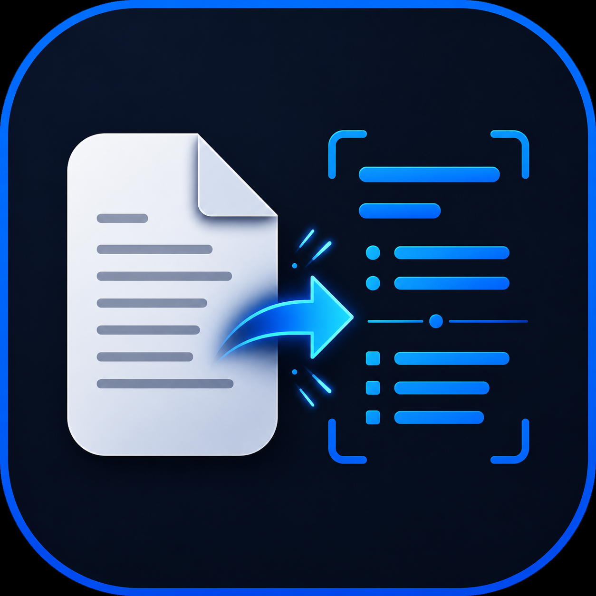

# Pdink

<p align="center">
  
</p>

<p align="center">
  <strong>Local-first document and image conversion for Windows.</strong><br>
  Convert files to Markdown or plain text with offline OCR.
</p>

<p align="center">
  <a href="../../releases/latest">Download the latest Windows installer</a>
  ·
  <a href="#building-from-source">Build from source</a>
  ·
  <a href="LICENSE">License</a>
</p>

## What Pdink does

- Converts PDFs, images, Word documents, spreadsheets, and presentations.
- Exports to **Markdown (`.md`)** or **plain text (`.txt`)**.
- Runs OCR locally with Tesseract—your document content is not uploaded for conversion.
- Lets you choose **one to three** OCR languages per conversion.
- Bundles a broad set of Tesseract language packs in the Windows installer.
- Remembers the last input folder, output folder, output format, and selected OCR languages.

## Download

The recommended way to use Pdink is the Windows installer published under
[Releases](../../releases/latest).

The installer includes the app, its local OCR runtime, and bundled language
data. No Python installation is required for normal use.

## Supported input types

| Category | Formats |
| --- | --- |
| Documents | PDF, DOCX, XLSX, XLS, PPTX |
| Images | PNG, JPG, JPEG, BMP, TIFF, WEBP |
| Output | Markdown (`.md`), plain text (`.txt`) |

## Privacy

Pdink performs document conversion and OCR on the local computer. It does not
send source documents to an online conversion service.

## Building from source

Pdink is currently built for **Windows 10/11 x64**.

```powershell
git clone https://github.com/omaragain/pdink.git
cd pdink

py -3.13 -m venv .venv
.\.venv\Scripts\Activate.ps1

python -m pip install --upgrade pip
python -m pip install -r requirements.txt
```

Prepare the local Tesseract runtime and language data as described in
[`docs/BUILD_WINDOWS.md`](docs/BUILD_WINDOWS.md), then build the application:

```powershell
python -m PyInstaller --noconfirm --clean --windowed --onedir `
  --contents-directory . `
  --name Pdink `
  --icon ".\assets\Pdink.ico" `
  --add-data "runtime;runtime" `
  --add-data "assets;assets" `
  --collect-all markitdown `
  .\app\main.py
```

## Project structure

```text
app/             Application interface and conversion engine
assets/          Pdink icon assets
installer/       Installer definition and language-pack tooling
docs/            Build, release, and contributor documentation
runtime/         Generated local OCR runtime (not committed)
```

## License

Pdink is distributed under the GNU Affero General Public License v3.0
(or later). See [`LICENSE`](LICENSE).

Pdink uses third-party components with their own license terms. See
[`NOTICE.md`](NOTICE.md).

## Credits

Created and maintained by [Omar Mannaa](https://github.com/omaragain).
